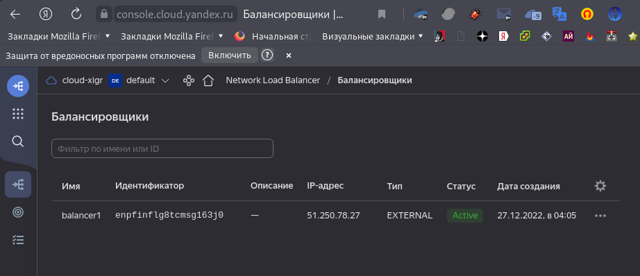
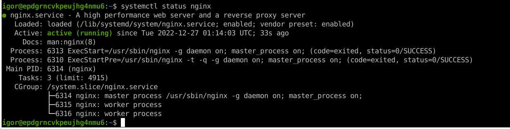
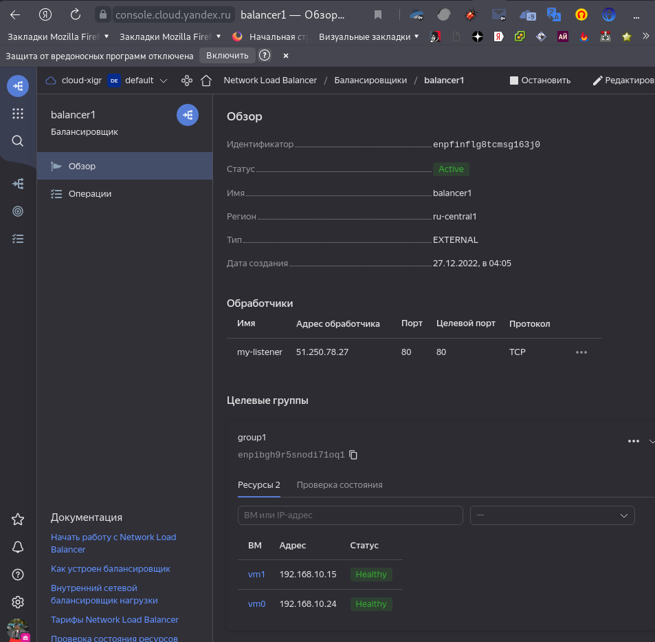
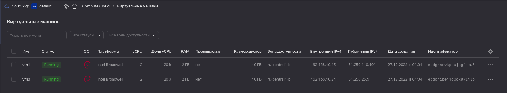
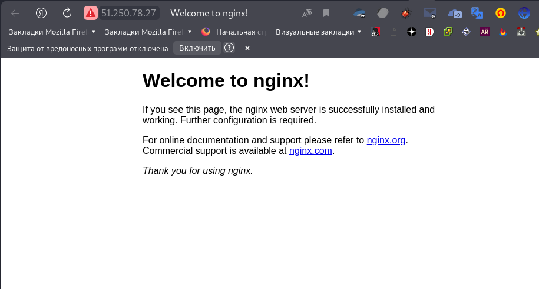

# Домашнее задание к занятию "`Отказоустойчивость в облаке`" - `Живарев Игорь`


```
terraform {
  required_providers {
    yandex = {
      source = "yandex-cloud/yandex"
    }
  }
}

provider "yandex" {
  token     = "xxxxxxxxxxxxxxxxxxxxxxxxxxxxxxxxxxxxxxxxxxxxxxxxxx"
  cloud_id  = "b1gqb0osv3jfis64rapf"
  folder_id = "b1gfsa2tbdkktui2b7qs"
  zone      = "ru-central1-b"
}

resource "yandex_compute_instance" "vm" {
  count       = 2
  name        = "vm${count.index}"

  resources {
    cores         = 2
    memory        = 2
    core_fraction = 20
  }

  boot_disk {
    initialize_params {
      image_id = "fd8pqqqelpfjceogov30"
      size     = 10
    }
  }

  network_interface {
    subnet_id = yandex_vpc_subnet.subnet-1.id
    nat       = true
  }

  metadata = {
    user-data = "${file("./meta.txt")}"
  }
}


resource "yandex_vpc_network" "network-1" {
  name = "network1"
}

resource "yandex_vpc_subnet" "subnet-1" {
  name           = "subnet1"
  zone           = "ru-central1-b"
  network_id     = yandex_vpc_network.network-1.id
  v4_cidr_blocks = ["192.168.10.0/24"]
}

resource "yandex_lb_target_group" "group-1" {
  name      = "group1"

  target {
    subnet_id = "${yandex_vpc_subnet.subnet-1.id}"
    address   = "${yandex_compute_instance.vm[0].network_interface.0.ip_address}"
  }

  target {
    subnet_id = "${yandex_vpc_subnet.subnet-1.id}"
    address   = "${yandex_compute_instance.vm[1].network_interface.0.ip_address}"
  }
}

resource "yandex_lb_network_load_balancer" "balancer-1" {
  name = "balancer1"

  listener {
    name = "my-listener"
    port = 80
  }

  attached_target_group {
    target_group_id = "${yandex_lb_target_group.group-1.id}"

    healthcheck {
      name = "http"
      http_options {
        port = 80
        path = "/"
      }
    }
  }
}

....
```









---

